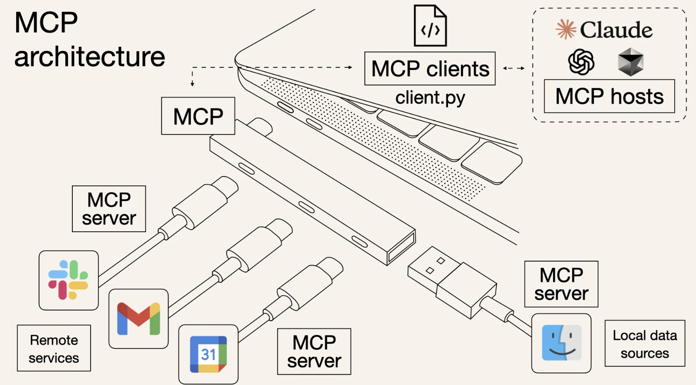
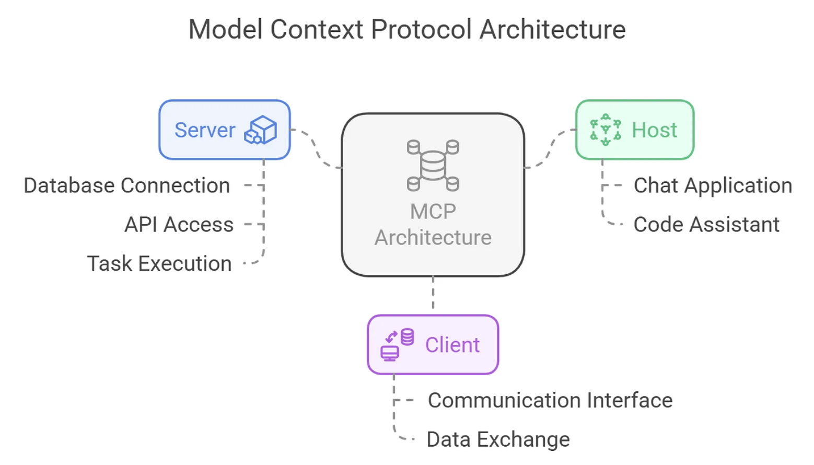

= AN AI AGENT of real-time digital humans
Author whoyiming <whoyiming@outlook.com>
:doctype: book
:source-highlighter: highlightjs
:toc: left
:toclevels: 3
:sectnums:
:sectid:
:icons: fon

[preface]
== 引言
This repo contains notes on the development of AI AGENT real-time digital humans.

== 环境
=== 安装python3.12及uv库
=== 安装nodejs, npm install -g next heroui-cli pnpm
=== 登录 https://www.aliyun.com/product/bailian[百炼平台]，开通模型调用服务
=== 本地安装ollama，部署模型，详情参考部署文档
=== apt install ffmpeg

[TIP]
如果是windows下安装ffmpeg，需要将bin目录装载到环境变量中，项目才能调用到

== ADH
课程中的项目来自开源项目，老师经过部分修改后的 https://github.com/freecoinx/awesome-digital-human-live2d[项目地址]
ADH 项目分成后端和前端两部分。后端使用 Python 开发，开发框架是 FastAPI。前端使用 TypeScript 开发，开发框架是 Next.js + React + HeroUI。整个项目在work目录下完成。

后端
[soruce, terminal]
----
mkdir work
cd work
git clone https://github.com/freecoinx/awesome-digital-human-live2d.git
cd awesome-digital-human-live2d
# 初始化一个 uv 项目
uv init
vi pyproject.toml
[[tool.uv.index]]
url = "https://pypi.tuna.tsinghua.edu.cn/simple" 
default = true

添加所有依赖到 uv 创建的虚拟环境
uv add $(cat requirements.txt)

uv run python main.py
----

前端
[soruce, terminal]
----
cd awesome-digital-human-live2d/web
pnpm install
pnpm run build
pnpm run dev # 如果没有dev配置文件，直接pnpn run start

----

== 创建Agent SDK
=== 用 uv 创建项目与引用
[soruce, terminal]
----
cd ~/work
# 用 uv 创建两个项目
uv init aa
uv init bb

# 在aa中创建子目录
mkdir aaa
vi aatest.py
def testaa():
    print("aaa testaa")

# 切换到bb目录，在bb中引入aaa包
vi main.py

from aaa.aatest import testaa

def main():
    print("Hello from bb!")
    testaa()

if __name__ == "__main__":
    main()

# 在bb目录下链接
cd bb
uv add ../aa --dev
uv pip install -e "../aa"

#运行，可以看到testaa()的输出
uv run python main.py
----
项目结构：
[source,tree]
----
work/
├── aa/
│   ├── aaa/
│   │   ├── __init__.py
│   │   └── aatest.py
│   └── pyproject.toml
└── bb/
    ├── bb/
    │   └── __init__.py
    ├── main.py
    └── pyproject.toml

# 注意aa项目下aaa包中一定要加上__init__.py
----

=== ADH引用外部agent
[soruce, terminal]
----
cd ~/work
uv init adh_ai_agent
git clone https://gitee.com/mozilla88/adh_agent_tutorial.git
cd adh_ai_agent
# lesson_03是一个关于24点的agent
cp ~/work/adh_agent_tutorial/lesson_03/adh_ai_agent/*.py .

# 编辑 pyproject.toml
[[tool.uv.index]]
url = "https://pypi.tuna.tsinghua.edu.cn/simple"
default = true

[build-system]
requires = ["setuptools>=42"]
build-backend = "setuptools.build_meta"

# 添加依赖
uv add openai-agents

# 将adh_ai_agent添加到awesome-digital-human-live2d
uv add ../adh_ai_agent --dev
uv pip install -e "../adh_ai_agent"

# configs/agents 子目录中为 OutsideAgent 创建一个配置文件 outsideAgent.yaml
# adh_ai_agent的play_24_points_game_v2.py 可以修改模型的apikey和url
# 配置完成后，切换到awesome-digital-human-live2d，uv run python main.py,就可以调用外部agent，测试24点
----

== RAG
简单来说，RAG 是一种将信息检索（搜索）与文本生成（大语言模型）相结合的人工智能框架。它的核心思想是：在让大语言模型生成答案之前，先从外部知识库中检索出与用户问题最相关的信息片段，并将这些信息片段（上下文）连同用户问题一起输入给大语言模型，从而生成更准确、更相关、信息更丰富的回答。

排除掉成本很高的 LLM 微调之外，建立 LLM 与外部数据源的桥梁，主要有两种技术手段：

* 第一种技术手段是 OpenAI 发布的 Assistants API，也就是大家俗称的 Function Call。那个 24 点游戏智能体通过 Assistants API 调用外部函数，获得 24 点游戏表达式。

* 第二种技术手段是 RAG，这个缩写词的全称是 Retrieval-Augmented Generation，翻译为检索增强生成。

RAG的几个优势：

* 通过实时数据访问为 LLM 解决方案提供支持，可以动态更新知识，提高准确性和相关性
* 保护数据隐私（可以构建私人本地数据库）
* 减轻 LLM 的幻觉（不使用大模型所谓的“记忆”，只利用的大模型的逻辑推理能力）
* 成本效益： 相对于微调大型模型，维护和更新知识库的成本通常更低。

RAG vs. 微调

RAG 和模型微调都是提升模型在特定任务或领域表现的技术，但思路不同：

* 微调： 通过特定数据集调整模型本身的权重参数，将新知识“内化”到模型中。适用于学习特定风格、任务格式或稳定、核心的领域知识。更新知识需要重新训练。

* RAG： 保持模型参数不变，通过动态检索外部知识来增强模型的输入。适用于需要频繁更新知识、利用大型外部知识库、或要求答案可追溯的场景。

=== 对外部数据源Retrieval
[source, terminal]
----
uv add nltk pypdf requests tiktoken
cd work
# 将lesson_09中的文件复制到ADH_AI_AGENT中
cp ../adh_agent_tutorial/lesson_09/adh_ai_agent/rag_without_vecdb.py adh_ai_agent/
cp ../adh_agent_tutorial/lesson_09/adh_ai_agent/tourism_rag_agent.py adh_ai_agent/

cd adh_ai_agent
mkdir data
# rag_without_vecdb.py 中有model_id、apikey
export EXAMPLE_API_KEY=xxxx # powershell的命令: $env:EXAMPLE_API_KEY="xxx"
uv run python rag_without_vecdb.py --preprocess
# 命令执行成功之后，预处理的结果保存在 “data/document_chunks.pkl” 文件中

uv run python rag_without_vecdb.py

# 实现 AI Agent 并与 ADH 对接
cd ~/work/awesome-digital-human-live2d
uv pip install -e "../adh_ai_agent"
ln -s ../adh_ai_agent/data .

----

=== RAG 使用向量数据库
将自然语言的文本转换为某个向量空间中的一个坐标，向量空间的维度会非常大，可以达到几百维甚至几千维。不仅自然语言的最小单元 token 可以转换为向量，由 token 组成的句子、由句子组成的段落都可以转换为向量。这个技术就叫做文本向量化，又叫做文本嵌入（Text Embedding）。而专门为完成文本向量化而训练的一类语言模型，称作嵌入模型（Embedding Models）

使用嵌入模型实现了文本的向量化之后，这些文本的向量化表示需要持久保存起来，以备后续使用。同时还需要将这些保存的向量表示与某个请求文本所对应的向量做相关性的搜索，以便找到最相关的文本内容。实现文本向量表示和向量相关性搜索的基础设施，就是向量数据库。

商业版嵌入模型

因为文本嵌入是极为重要的技术，所以很多基础 LLM 厂商同时也都有自己的嵌入模型。例如 OpenAI、Google、阿里云、腾讯云、智谱 AI 等等。

开源嵌入模型

* nomic-embed-text
* bge-large
* bge-m3
* 等

编辑一个测试代码 test_ollama_embedding_model.py
[source, python]
----
from openai import OpenAI
 
client = OpenAI(
    api_key='ollama',
    base_url='http://localhost:11434/v1/',
)
 
response = client.embeddings.create(
    model="nomic-embed-text",
    input=["input1", "input2"], #  "input1" also works, no other input type is supported
)
 
print(response)
----

将lesson_10/adi_ai_agent/rag_with_vecdb.py 复制到 adh_ai_agent,在adh_ai_agent项目中添加依赖库
[source, terminal]
----
cd ~/work/adh_ai_agent
uv add beautifulsoup4 faiss-cpu patchright

# Patchright 这个库是微软公司开源 Playwright 的兼容替代版本，用来调用浏览器来执行各种自动化操作。这个库的优点是比 Playwright 库更加隐蔽，更不容易被某些网站的反爬虫功能检测到。Playwright 和 Patchright 现在在浏览器自动化测试方面已经取代了老牌的 Selenium。

uv run patchright install chromium

----

rag_with_vecdb.py，理解这个文件，有用到网页内容的提取、向量数据的存储等。

[source, terminal]
export EXAMPLE_API_KEY=xxxx 
uv run python adh_ai_agent/rag_with_vecdb.py

== MCP
 Model Context Protocol，翻译为模型上下文协议。它是由 LLM 一线大厂 Anthroipc 于 2024 年 11 月发布的一个 https://docs.anthropic.com/zh-CN/docs/agents-and-tools/mcp[规范]。
 

MCP 采用客户 - 服务器（C/S）架构 运行，确保 LLM 能够高效、安全地访问和利用外部数据。MCP 的架构由以下三个核心组件组成：

* MCP 主机（MCP Hosts）：利用外部数据的应用程序，如 Claude Desktop、IDE 或 AI 辅助工具，还有我们开发的各种 AI Agent。

* MCP 客户端（MCP Clients）：负责与 MCP 服务器建立安全、稳定的连接，充当通信桥梁。

* MCP 服务器（MCP Server）：一个轻量级程序，通过标准化的模型上下文协议（MCP）公开特定功能，使 LLM 能够访问外部资源并执行任务。

MCP 的架构图：

MCP 的架构支持 MCP 主机通过 MCP 客户端连接多个 MCP 服务器，每个服务器都提供独立的功能，实现了模块化和灵活的集成。MCP 服务器提供了三类公开接口：

* 资源访问：允许 LLM 加载数据源，例如本地文件、文档或数据库查询。

* 工具调用：支持 LLM 执行特定操作，例如 API 调用或命令执行。

* 交互提示：提供可重复使用的 LLM 交互模板，指导 LLM 在特定场景下的行为，提升任务执行的准确性与效率。

在 MCP 体系架构中，MCP 服务器是最核心的组件。MCP 服务器是一种专门设计的程序，使得 LLM 能够安全、标准化地访问和使用外部数据与工具。MCP 服务器扩展了 LLM 的能力，使得 LLM 不仅能生成文本，还能直接与计算机文件、数据库，甚至 GitHub 等服务进行交互。

MCP 核心架构：三大角色
MCP 的设计逻辑十分直观，围绕以下三类主体展开：

1. 主机（Host）
主机是 MCP 体系的“大脑”，它负责：

* 创建并管理多个客户端实例
* 掌控客户端的访问权限与生命周期
* 实施安全策略与权限校验
* 协调 AI/LLM 与各组件之间的交互

    在实际使用中，主机通常指你正在运行的 AI 应用，比如 Claude Desktop、Cursor 编辑器，或其他兼容 MCP 的工具。

2. 客户端
客户端由主机动态生成，用来对接特定服务器，它的职责包括：
* 与某一服务器建立专属会话
* 完成协议协商与功能能力交换
* 在服务器与主机间进行双向消息转发
* 每个客户端实例仅专注于与对应服务器的通信，确保信息流畅无误。

3. 服务器
服务器是功能和数据的提供者：
* 通过 MCP 接口暴露资源、工具或提示模板
* 独立运行，专注履行自身职责
* 可部署为本地进程或远程服务

部分AI Agent开发框架的MCP：

OpenAI Agent SDK 的 MCP 支持： https://openai.github.io/openai-agents-python/mcp/

微软 AutoGen 的 MCP 支持： https://microsoft.github.io/autogen/stable//user-guide/core-user-guide/components/workbench.html

谷歌 Assistant SDK (ADK) 的 MCP 支持： https://google.github.io/adk-docs/tools/mcp-tools/

LangGraph 的 MCP 支持：  https://langchain-ai.github.io/langgraph/agents/mcp/

LlamaIndex 的 MCP 支持： https://docs.llamaindex.ai/en/stable/api_reference/tools/mcp/

Camel 的 MCP 支持： https://mcp.camel-ai.org/

国内最大的 MCP 中文社区来了，4000 多个服务等你体验  https://developer.aliyun.com/article/1661258

根据 Agent SDK 官方文档  https://openai.github.io/openai-agents-python/mcp/ 中的介绍，在 Agent SDK 中，根据不同的传输机制支持使用 3 类 MCP 服务器：

stdio 服务器：作为应用程序的子进程运行，可视为“本地”运行模式。实现类为 MCPServerStdio。

HTTP over SSE 服务器：以远程方式运行，需要通过 URL 进行远程连接。实现类为 MCPServerSse。

支持流式输出的 HTTP 服务器：以远程方式运行，使用 MCP 规范中定义的支持流式输出的 HTTP 传输机制。实现类为 MCPServerStreamableHttp。

MCP 服务器可被添加到 AI Agent 中。每次运行 AI Agent 时，Agents SDK 都会调用 MCP 服务器的 list_tools() 方法，使 LLM 感知该服务器提供的工具。当 LLM 调用 MCP 服务器的工具时，Agent SDK 会调用该服务器的 call_tool() 方法。

开发了一个以 SSE 模式运行的 MCP Sever，作用是查询某个城市当天的天气。对应前面说过的 Agent SDK 支持的第二类 MCP Server。
[source, terminal]
----
cd ~/work/adh_ai_agent
cp ../adh_agent_tutorial/lesson_11/adh_ai_agent/*.py adh_ai_agent/

uv add "mcp[cli]"
uv run python adh_ai_agent/weather_mcp_server.py
run_agent_sdk_app adh_ai_agent/weather_mcp_host.py 

----